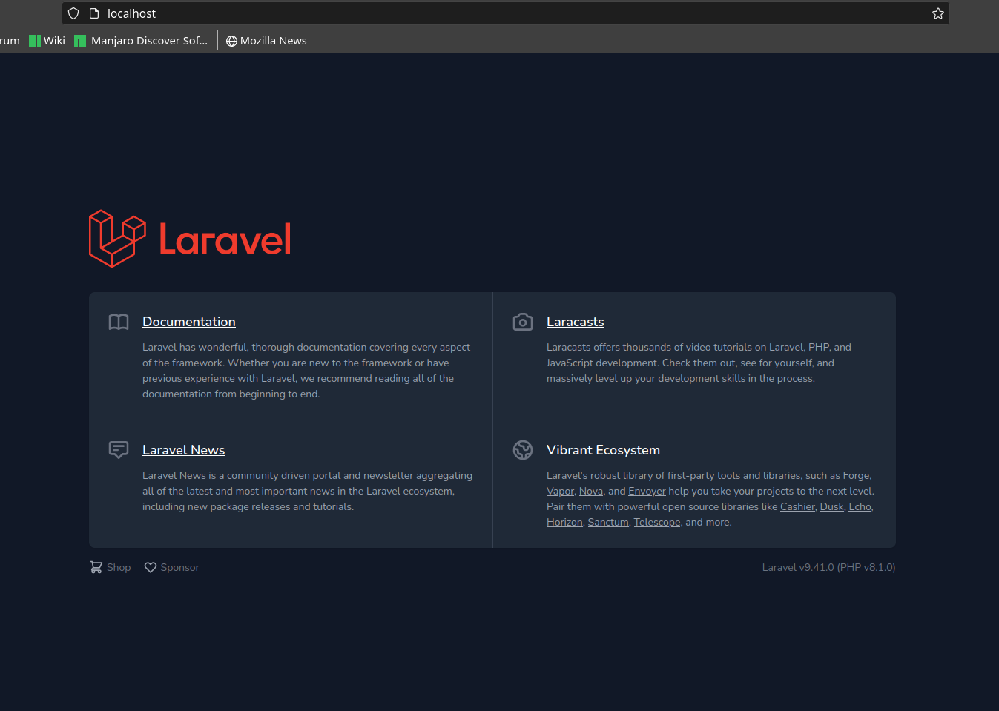

# Docker Compose Nginx PHP Laravel MariaDB (LEMP stack)

A ready to use Docker Compose configuration for a LEMP stack (Nginx, PHP, Laravel, MariaDB, and PHPMyAdmin).

## Requirements

- Docker
- Docker Compose

## Usage

- Clone this repository
- Run `docker-compose up -d`
- Open `http://localhost:80` in your browser for Nginx
- Open `http://localhost:8080` in your browser for PHPMyAdmin

## Config files

- `./nginx/default.conf:/etc/nginx/conf.d/default.conf`
- `./php/local.ini:/usr/local/etc/php/conf.d/local.ini`
- `./mysql:/etc/mysql/conf.d`
